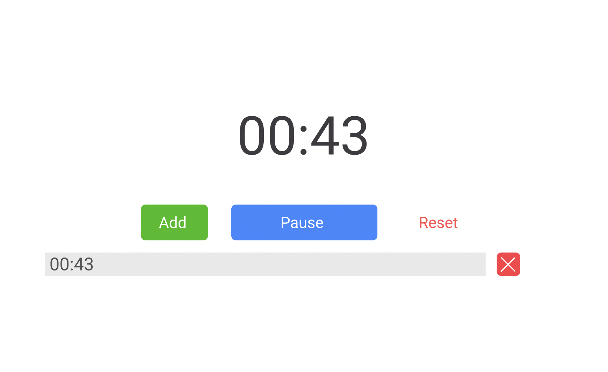

# Task

Design UI, below

 

1. Your task is to design given task as it is. When clicking the button "START", it should start counting. 

2. If you click <code>Pause</code> button, it should save current state ( Count ) then save it to LocalStorage. Whenever the page is refreshed, it should continue from where it has stopped.  

3. When you click <code>Reset</code> button, state (Count) and LocalStorage should be cleaned.

4. When you click <code>Add</code> button, you have to log the current state in list. And you have to manipulate the array of list. (CRUD)

